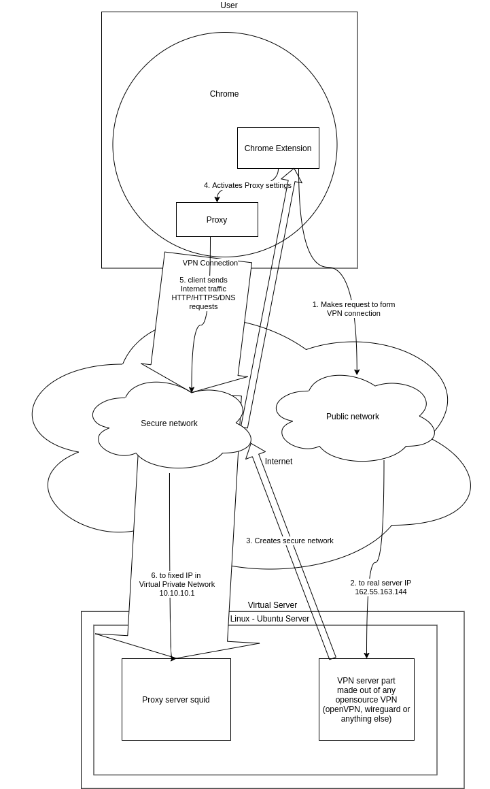

.. darkbot documentation master file, created by
   sphinx-quickstart on Thu May  6 20:10:46 2021.
   You can adapt this file completely to your liking, but it should at least
   contain the root `toctree` directive.

Welcome to js vpn client's documentation!
==========================================

.. toctree::
   :maxdepth: 3
   :caption: Contents:

Description
******************

* a program capable to raise VPN tunnel from browser javascript to server, and redirecting browser traffic through proxy at the server.

What we expect to receive:
***************************

* chrome-extension code + instruction on how to set up server-side part (preferably for Linux / Ubuntu)
* secured HTTP/HTTPS/DNS traffic from the client to the server

What we would prefer to see in the code:
******************************************

* Readability in English
* Testing
* Self-documentation.

Example of the extension
***************************

manifest.json
----------------

.. literalinclude:: example/manifest.json
            :language: JSON

background.js
----------------

.. literalinclude:: example/background.js
            :language: javascript

How we see the architecture:
*****************************

Notes
*****************************

* Server side can made out of any open source VPN. OpenVPN is preferable, but anything else (like Wireguard or IPSec) will work too.
* Possibly it could be made with IPSec, at least we saw working javascript example that claims being made with it.
* We don't need any GUI to it.

Indices and tables
==================

* :ref:`genindex`
* :ref:`modindex`
* :ref:`search`
